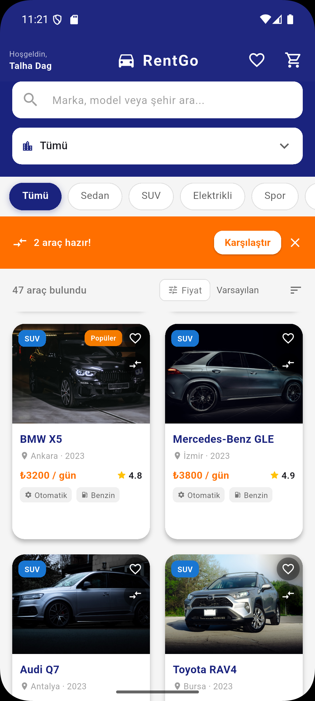
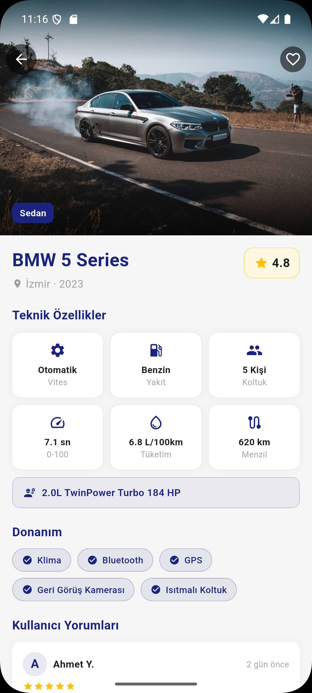
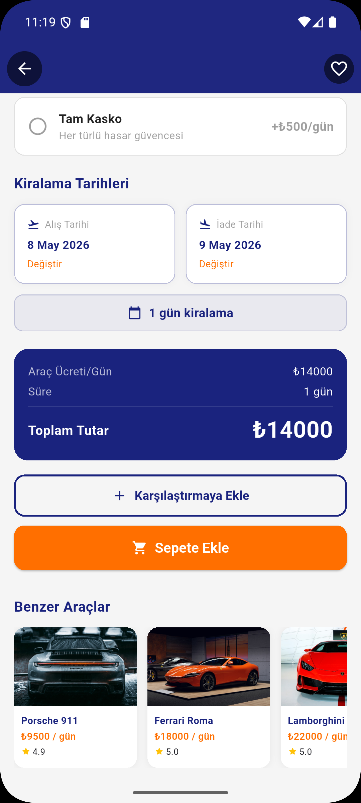
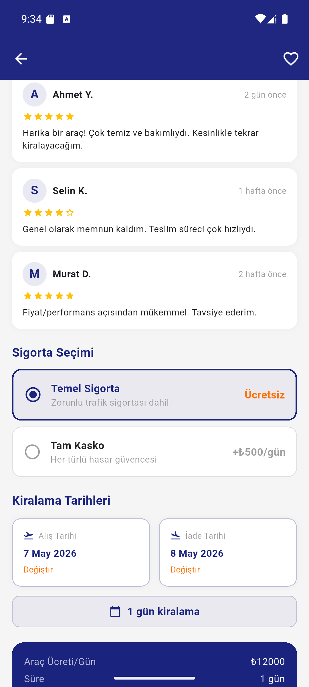
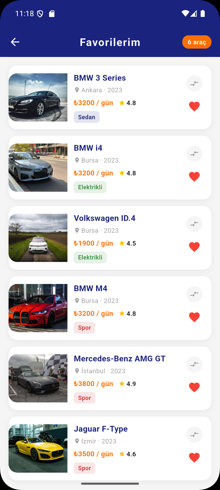
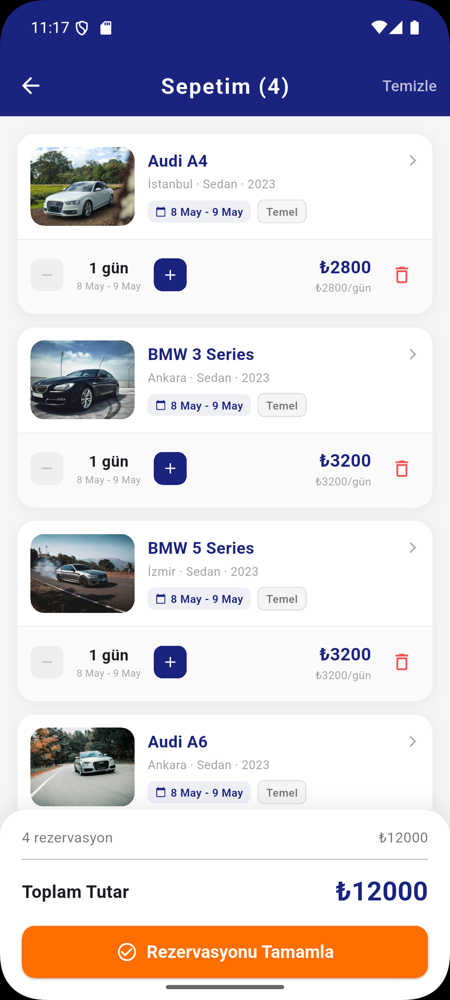
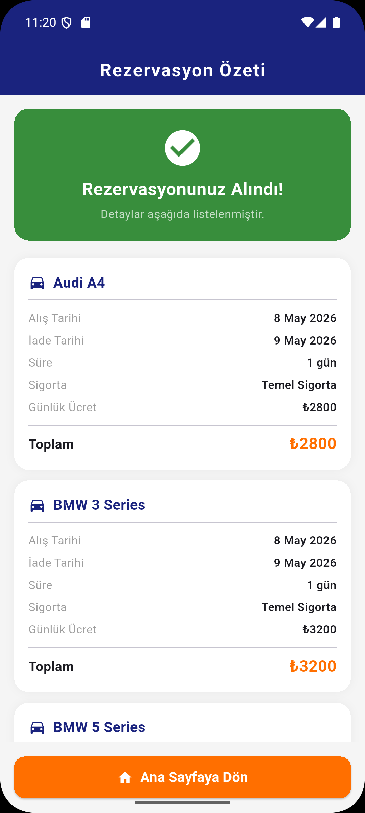
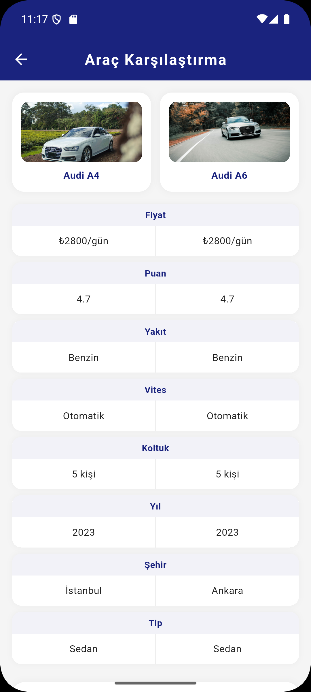

# 🚗 RentGo — Araç Kiralama Uygulaması

> Flutter ile geliştirilmiş, modern ve kullanıcı dostu bir araç kiralama kataloğu uygulaması. Gerçek web servislerinden çekilen araç verileri ile kullanıcılar araçları listeleyebilir, filtreleyebilir, karşılaştırabilir, favorilere ekleyebilir ve rezervasyon yapabilir. Uygulama; temiz mimari yapısı, animasyonlu arayüzü ve kapsamlı özellikleriyle Flutter'ın sunduğu imkânları tam anlamıyla yansıtmaktadır.

---

## 📱 Ekran Görüntüleri

### Onboarding & Giriş

<p align="center">
  
  &nbsp;&nbsp;
  
  &nbsp;&nbsp;
  
  &nbsp;&nbsp;
  
</p>

### Ana Sayfa & Araç Detayı

<p align="center">
  
  &nbsp;&nbsp;
  
  &nbsp;&nbsp;
  
  &nbsp;&nbsp;
  
</p>

### Favoriler, Sepet & Rezervasyon

<p align="center">
  
  &nbsp;&nbsp;
  
  &nbsp;&nbsp;
  
</p>

### Araç Karşılaştırma

<p align="center">
  
  &nbsp;&nbsp;
  
</p>

---

## ✨ Özellikler

| Özellik | Açıklama |
|---|---|
| 🔐 Kullanıcı Girişi | İsim ve soyisim ile kişiselleştirilmiş giriş |
| 🌐 Web Servis Entegrasyonu | İki farklı API'den gerçek araç verisi ve fotoğraf |
| 🗄️ Veri Modelleme | `Car.fromJson()` ile JSON → model dönüşümü |
| 💾 Yerel Cache | SharedPreferences ile araç listesi önbellekleme |
| 🚗 Araç Kataloğu | 48 araç, 5 kategori, 20+ farklı marka |
| 🔍 Akıllı Arama | Marka, model ve şehre göre anlık arama |
| 🏙️ Şehir Filtresi | İstanbul, Ankara, İzmir, Antalya, Bursa |
| 🏷️ Tip Filtresi | Sedan, SUV, Elektrikli, Spor, Minivan |
| 💰 Fiyat Filtresi | Slider ile min-max fiyat aralığı |
| 📊 Sıralama | Ucuzdan pahalıya, pahalıdan ucuza, puana göre |
| 📋 Araç Detayı | Motor, 0-100, tüketim, menzil, donanım listesi |
| 📅 Tarih Seçimi | Alış ve iade tarihi, geçmiş tarih engeli |
| 🛡️ Sigorta Seçimi | Temel sigorta veya tam kasko |
| 💳 Fiyat Hesabı | Gün × (araç + sigorta) anlık hesaplama |
| ❤️ Favoriler | Araçları favorilere ekle/çıkar |
| 🛒 Sepet | Aynı araç farklı tarih/sigorta ile birden fazla |
| ⚖️ Karşılaştırma | 2 aracı yan yana karşılaştır |
| 📄 Rezervasyon Özeti | Tamamlanan rezervasyonların detaylı özeti |
| 🌟 Kullanıcı Yorumları | Araç detayında kullanıcı değerlendirmeleri |
| 🔄 Benzer Araçlar | Aynı kategoriden öneri araçlar |

---

## 🌐 Web Servis Entegrasyonu

Uygulama iki farklı web servisinden HTTP GET istekleri ile gerçek veri çekmektedir. Gelen JSON verisi `Car.fromJson()` metodu ile Dart modeline dönüştürülmekte, `SharedPreferences` ile yerel olarak önbelleğe alınmaktadır.

### 1. NHTSA vPIC API — Araç Marka/Model Verisi

ABD Ulusal Karayolu Trafik Güvenliği İdaresi'nin resmi araç veritabanı. Ücretsiz, key gerektirmez.

| | |
|---|---|
| **Base URL** | `https://vpic.nhtsa.dot.gov/api/vehicles` |
| **Endpoint** | `GET /GetModelsForMake/{make}?format=json` |
| **Dönen Veri** | Araç marka, model adı, model ID |
| **Kullanım** | Her marka için model listesi çekilir |

```json
{
  "Count": 258,
  "Results": [
    { "Make_ID": 452, "Make_Name": "BMW", "Model_ID": 1707, "Model_Name": "128i" },
    { "Make_ID": 452, "Make_Name": "BMW", "Model_ID": 1710, "Model_Name": "M3" }
  ]
}
```

### 2. Unsplash API — Araç Fotoğrafları

Dünyanın en büyük ücretsiz fotoğraf platformu. Her araç için marka+model bazlı fotoğraf aranır.

| | |
|---|---|
| **Base URL** | `https://api.unsplash.com` |
| **Endpoint** | `GET /search/photos?query={make}+{model}&per_page=1` |
| **Header** | `Authorization: Client-ID {key}` |
| **Dönen Veri** | Fotoğraf URL'leri (thumbnail, regular, full) |
| **Kullanım** | Her araç için uygun fotoğraf çekilir |

```json
{
  "results": [
    {
      "urls": {
        "regular": "https://images.unsplash.com/photo-..."
      }
    }
  ]
}
```

### Veri Akışı

```
NHTSA API                    Unsplash API
(Marka/Model)                (Fotoğraf)
     │                            │
     └──────────┬─────────────────┘
                ▼
        CarService._buildCarJson()
                │
                ▼
          Car.fromJson()
                │
                ▼
     SharedPreferences Cache
                │
                ▼
       HomeScreen GridView
```

### Cache Mekanizması

- **İlk açılış:** API'den veri çekilir → `SharedPreferences`'a JSON olarak kaydedilir
- **Sonraki açılışlar:** Cache'den okunur → anında yüklenir, API çağrısı yapılmaz
- **Pull-to-refresh:** Cache temizlenir, API'den yeniden çekilir

---

## 🎨 Teknik Özellikler

- **Hero Animasyonu** — Araç kartından detaya geçişte görsel animasyonu
- **Skeleton Loading** — Yükleme sırasında shimmer animasyonlu placeholder kartlar
- **Swipe-to-Delete** — Sepette sola kaydırarak silme + hint animasyonu
- **Haptic Feedback** — Favori, sepet ve karşılaştırma işlemlerinde titreşim
- **Pull-to-Refresh** — Ana sayfada aşağı çekerek listeyi yenileme
- **Fiyat Animasyonu** — Detay sayfasında tarih/sigorta değişiminde fiyat animasyonu
- **AnimatedContainer** — Filtre chip'lerinde seçim animasyonu

---

## 🛠️ Kullanılan Teknolojiler

```
Flutter 3.41.9 (stable)
Dart 3.11.5
```

| Paket | Versiyon | Kullanım |
|---|---|---|
| `http` | ^1.2.2 | NHTSA ve Unsplash API HTTP istekleri |
| `shared_preferences` | ^2.3.2 | Araç listesi yerel önbellekleme |
| `cupertino_icons` | ^1.0.8 | iOS stil ikonlar |

**Mimari:**
- `StatelessWidget` / `StatefulWidget`
- `Navigator.push` / `pushReplacement` ile sayfa geçişleri
- `setState` ile state yönetimi
- `CarService` servis katmanı ile UI ve veri mantığı ayrımı
- `AppColors` ve `AppConfig` ile merkezi sabit yönetimi

---

## 📁 Proje Yapısı

```
lib/
├── main.dart                           # Uygulama giriş noktası & tema
├── constants/
│   ├── app_colors.dart                 # Merkezi renk sabitleri
│   └── app_config.dart                 # Uygulama sabitleri
├── models/
│   ├── car_model.dart                  # Araç modeli (fromJson/toJson)
│   └── cart_item_model.dart            # Sepet öğesi modeli
├── services/
│   └── car_service.dart                # NHTSA + Unsplash API & cache
├── screens/
│   ├── splash_screen.dart              # Açılış ekranı (2 sn)
│   ├── onboarding_screen.dart          # 3 sayfalık tanıtım
│   ├── login_screen.dart               # Kullanıcı giriş ekranı
│   ├── home_screen.dart                # Ana sayfa (liste, filtre, arama)
│   ├── detail_screen.dart              # Araç detay sayfası
│   ├── cart_screen.dart                # Sepet sayfası
│   ├── favorites_screen.dart           # Favoriler sayfası
│   ├── compare_screen.dart             # Araç karşılaştırma
│   └── reservation_summary_screen.dart # Rezervasyon özeti
├── utils/
│   ├── date_formatter.dart             # Tarih formatlama yardımcısı
│   └── snackbar_helper.dart            # Merkezi SnackBar yönetimi
└── widgets/
    ├── car_card.dart                   # Araç kart widget'ı
    ├── car_image.dart                  # Asset/Network görsel widget'ı
    └── skeleton_card.dart              # Yükleme animasyonu widget'ı
```

---

## 🔄 Uygulama Akışı

```
Splash (2sn)
    │
    ▼
Onboarding (3 sayfa)
    │
    ▼
Login (İsim & Soyisim)
    │
    ▼
Home (Araç Listesi)
    ├── Arama / Filtre / Sıralama
    ├── Araç Kartı → Detay
    │       ├── Tarih & Sigorta Seçimi
    │       ├── Sepete Ekle
    │       ├── Favoriye Ekle
    │       └── Karşılaştırmaya Ekle
    ├── Favoriler
    ├── Sepet → Rezervasyon Özeti
    └── Karşılaştırma (2 araç)
```

---

## 🚀 Çalıştırma Adımları

```bash
# 1. Projeyi klonla
git clone https://github.com/TalhaD-coder/Software-Persona-Mobil-Gelistirme_Flutter-Egitimi-Proje.git

# 2. Klasöre gir
cd mini_katalog

# 3. Bağımlılıkları yükle
flutter pub get

# 4. Uygulamayı çalıştır
flutter run
```

> **Not:** Android emülatör veya fiziksel Android cihaz gereklidir.  
> İlk açılışta API'den veri çekildiği için internet bağlantısı gereklidir.  
> Sonraki açılışlarda cache kullanıldığından internet bağlantısı gerekmez.

---

## 📚 Öğrenme Hedefleri

Bu proje aşağıdaki Flutter konularını kapsamaktadır:

- ✅ Widget ağacı ve Stateless/Stateful widget mantığı
- ✅ Navigator ile sayfa geçişleri ve veri aktarımı
- ✅ GridView ve ListView.builder ile dinamik listeler
- ✅ **Web servisinden HTTP GET ile veri çekme (NHTSA + Unsplash)**
- ✅ **Model sınıfı oluşturma ve JSON dönüşümü (`fromJson` / `toJson`)**
- ✅ **Yerel veri önbellekleme (SharedPreferences)**
- ✅ setState ile state yönetimi
- ✅ Material Design 3 tema ve bileşenleri
- ✅ Animasyonlar (Hero, AnimatedContainer, AnimatedSwitcher, SlideTransition)
- ✅ Form doğrulama (login ekranı)
- ✅ Tarih seçici (DatePicker)

---

## 👨‍💻 Geliştirici

**Talha Dağ**  
Flutter Günlük Eğitim Programı — Proje Çıktısı

---

<p align="center">
  <i>Flutter ile geliştirildi 🚀</i>
</p>
