# 🚗 RentGo — Araç Kiralama Uygulaması

<p align="center">
  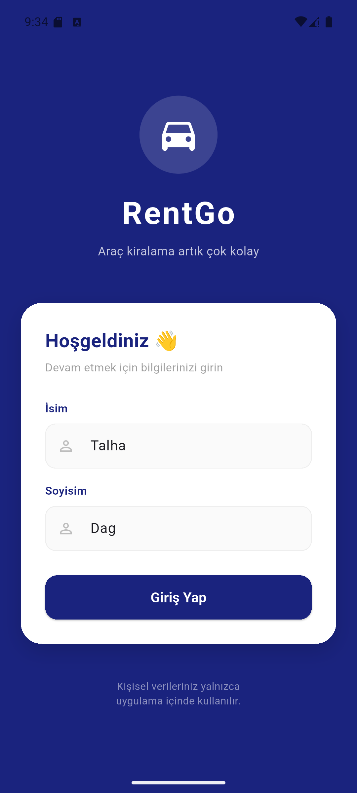
  &nbsp;
  
  &nbsp;
  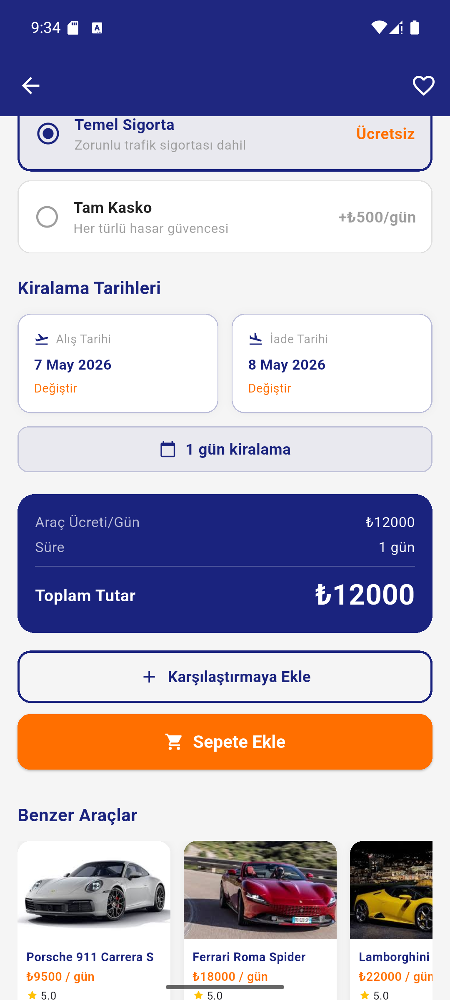
</p>

> Flutter ile geliştirilmiş, modern tasarımlı bir araç kiralama kataloğu uygulaması.  
> Kullanıcılar araçları listeleyebilir, filtreleyebilir, karşılaştırabilir ve rezervasyon yapabilir.

---

## 📱 Ekran Görüntüleri

### Onboarding & Giriş

<p align="center">
  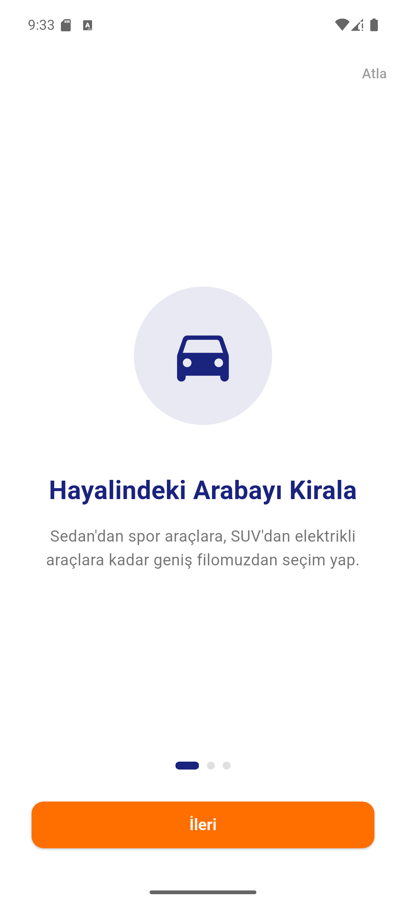
  &nbsp;
  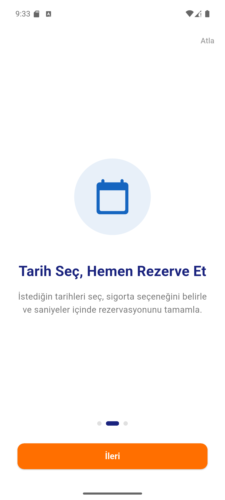
  &nbsp;
  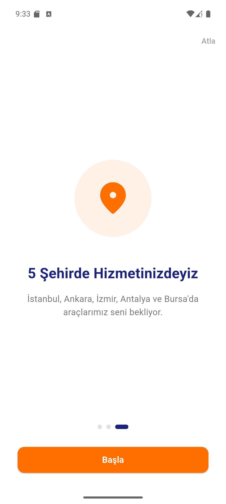
  &nbsp;
  
</p>

### Ana Sayfa & Araç Detayı

<p align="center">
  
  &nbsp;
  
  &nbsp;
  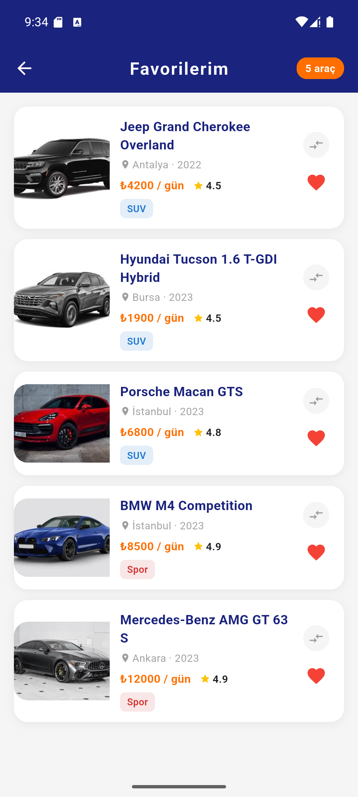
  &nbsp;
  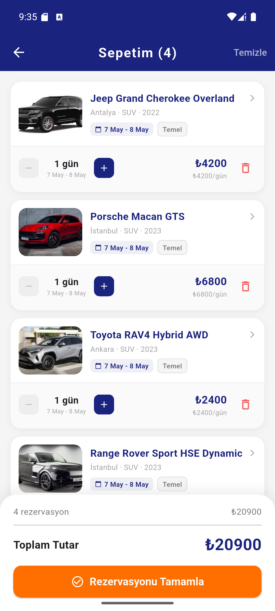
</p>

### Favoriler, Sepet & Karşılaştırma

<p align="center">
  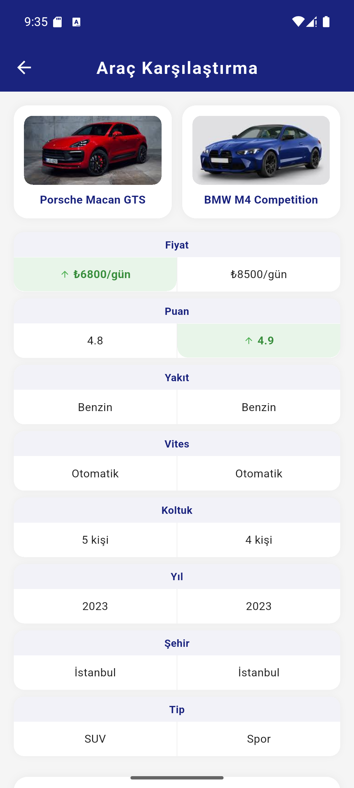
  &nbsp;
  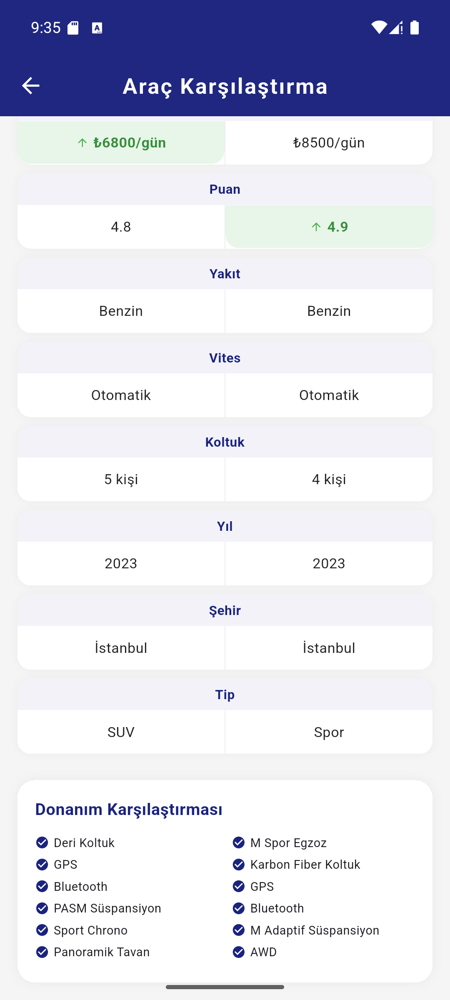
  &nbsp;
  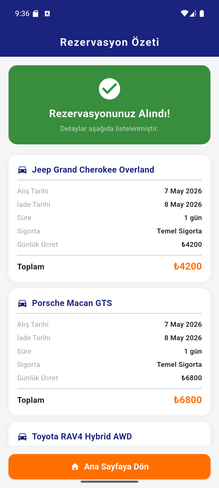
  &nbsp;
  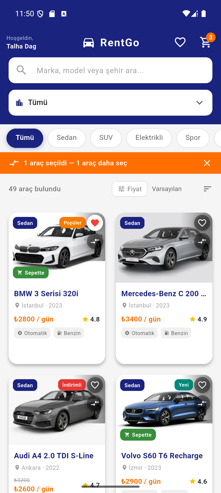
</p>

### Rezervasyon Özeti

<p align="center">
  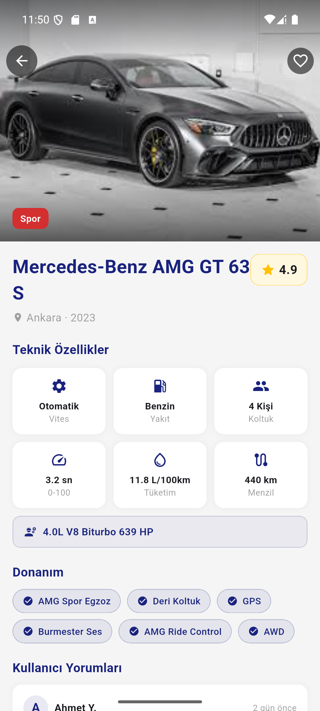
</p>

---

## ✨ Özellikler

| Özellik | Açıklama |
|---|---|
| 🔐 Kullanıcı Girişi | İsim ve soyisim ile kişiselleştirilmiş giriş |
| 🚗 Araç Kataloğu | 50 araç, 5 kategori, 30+ farklı marka |
| 🔍 Akıllı Arama | Marka, model ve şehre göre anlık arama |
| 🏙️ Şehir Filtresi | İstanbul, Ankara, İzmir, Antalya, Bursa |
| 🏷️ Tip Filtresi | Sedan, SUV, Elektrikli, Spor, Minivan |
| 💰 Fiyat Filtresi | Slider ile min-max fiyat aralığı |
| 📊 Sıralama | Ucuzdan pahalıya, pahalıdan ucuza, puana göre |
| 📋 Araç Detayı | Motor, 0-100, tüketim, menzil, donanım |
| 📅 Tarih Seçimi | Alış ve iade tarihi, geçmiş tarih engeli |
| 🛡️ Sigorta Seçimi | Temel sigorta veya tam kasko |
| 💳 Fiyat Hesabı | Gün × (araç + sigorta) anlık hesaplama |
| ❤️ Favoriler | Araçları favorilere ekle/çıkar |
| 🛒 Sepet | Aynı araç farklı tarih/sigorta ile birden fazla |
| ⚖️ Karşılaştırma | 2 aracı yan yana karşılaştır |
| 📄 Rezervasyon Özeti | Tamamlanan rezervasyonların detaylı özeti |
| 🌟 Kullanıcı Yorumları | Araç detayında kullanıcı değerlendirmeleri |
| 🔄 Benzer Araçlar | Aynı kategoriden öneri araçlar |

---

## 🎨 Teknik Özellikler

- **Hero Animasyonu** — Araç kartından detaya geçişte görsel animasyonu
- **Skeleton Loading** — İlk yüklemede shimmer animasyonlu placeholder
- **Swipe-to-Delete** — Sepette sola kaydırarak silme
- **Haptic Feedback** — Favori, sepet ve karşılaştırma işlemlerinde titreşim
- **Pull-to-Refresh** — Ana sayfada aşağı çekerek yenileme
- **Fiyat Animasyonu** — Detay sayfasında fiyat değişiminde animasyon
- **Hint Animasyonu** — Sepette swipe özelliğini gösteren ipucu

---

## 🛠️ Kullanılan Teknolojiler

```
Flutter 3.41.9 (stable)
Dart 3.11.5
```

**Paketler:** Yalnızca `material.dart` (ekstra paket kullanılmamıştır)

**Mimari:**
- `StatelessWidget` / `StatefulWidget`
- `Navigator.push` / `pushReplacement` ile sayfa geçişleri
- `Route Arguments` ile sayfalar arası veri taşıma
- `setState` ile state yönetimi

---

## 📁 Proje Yapısı

```
lib/
├── main.dart                          # Uygulama giriş noktası & tema
├── constants/
│   ├── app_colors.dart                # Merkezi renk sabitleri
│   └── app_config.dart                # Uygulama sabitleri (limitler, süreler)
├── data/
│   └── mock_data.dart                 # 50 araç mock verisi
├── models/
│   ├── car_model.dart                 # Araç modeli (fromJson/toJson)
│   └── cart_item_model.dart           # Sepet öğesi modeli
├── screens/
│   ├── splash_screen.dart             # Açılış ekranı
│   ├── onboarding_screen.dart         # 3 sayfalık tanıtım
│   ├── login_screen.dart              # Kullanıcı giriş ekranı
│   ├── home_screen.dart               # Ana sayfa (liste, filtre, arama)
│   ├── detail_screen.dart             # Araç detay sayfası
│   ├── cart_screen.dart               # Sepet sayfası
│   ├── favorites_screen.dart          # Favoriler sayfası
│   ├── compare_screen.dart            # Araç karşılaştırma
│   └── reservation_summary_screen.dart # Rezervasyon özeti
├── utils/
│   ├── date_formatter.dart            # Tarih formatlama yardımcısı
│   └── snackbar_helper.dart           # Merkezi SnackBar yönetimi
└── widgets/
    ├── car_card.dart                  # Araç kart widget'ı
    ├── car_image.dart                 # Asset/Network görsel widget'ı
    └── skeleton_card.dart             # Yükleme animasyonu widget'ı
```

---

## 🚀 Çalıştırma Adımları

```bash
# 1. Projeyi klonla
git clone https://github.com/TalhaD-coder/Software-Persona-Mobil-Gelistirme_Flutter-Egitimi-Proje.git

# 2. Klasöre gir
cd mini_katalog

# 3. Bağımlılıkları yükle
flutter pub get

# 4. Uygulamayı çalıştır
flutter run
```

> **Not:** Android emülatör veya fiziksel Android cihaz gereklidir.

---

## 📚 Öğrenme Hedefleri

Bu proje aşağıdaki Flutter konularını kapsamaktadır:

- ✅ Widget ağacı ve Stateless/Stateful widget mantığı
- ✅ Navigator ile sayfa geçişleri ve Route Arguments
- ✅ GridView ve ListView.builder ile dinamik listeler
- ✅ Model sınıfı oluşturma ve JSON dönüşümü
- ✅ setState ile basit state yönetimi
- ✅ Asset yönetimi (görseller)
- ✅ Material Design 3 tema ve bileşenleri
- ✅ Animasyonlar (Hero, AnimatedContainer, AnimatedSwitcher)

---

## 👨‍💻 Geliştirici

**Talha Dağ**  
Flutter Günlük Eğitim Programı — Proje Çıktısı

---

<p align="center">
  <i>Flutter ile geliştirildi 🚀</i>
</p>
